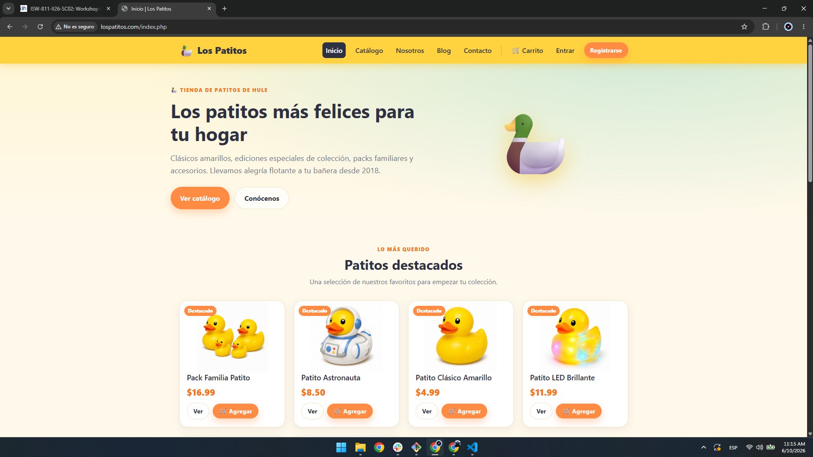
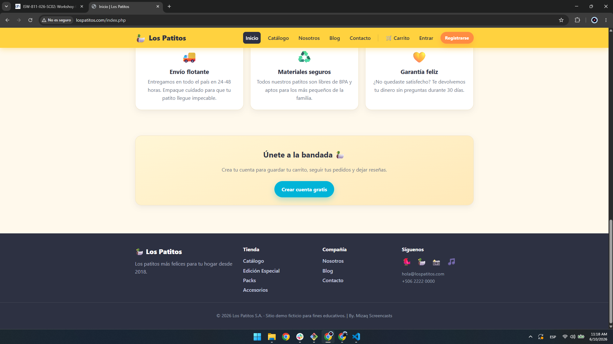
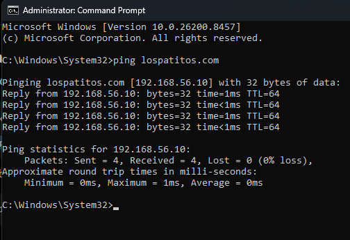
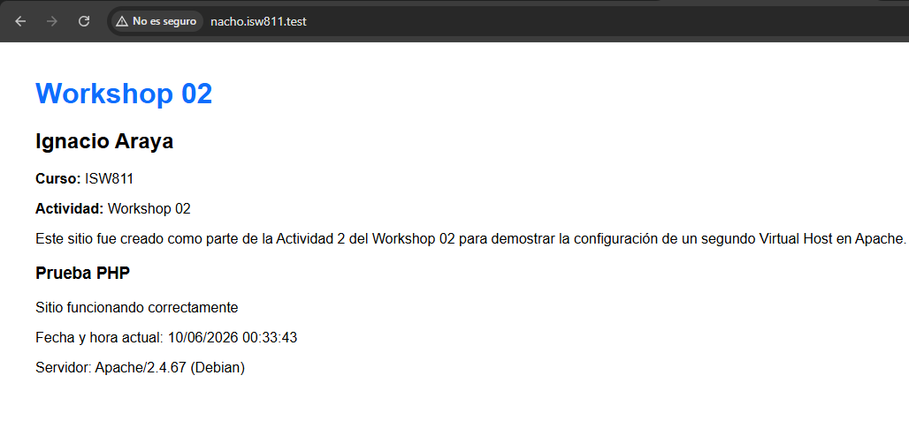
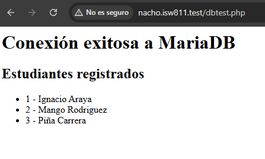
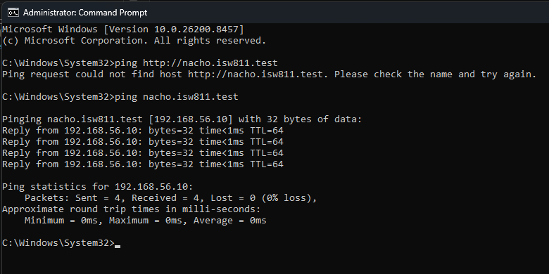

# Workshop 02 - Despliegue de un Entorno LAMP con Vagrant

**Estudiante:** Ignacio Araya Rojas
**Curso:** ISW811
**Workshop 02**
**Fecha de entrega:** 6/10/2026
**Docente:** Misael Matamoros

## Repositorio GitHub

Repositorio utilizado para almacenar este Workshop02 y futuros Workshops del Curso:

https://github.com/nachoar24/Workshops---Software-Libre

---

# Introducción

El objetivo de este taller fue configurar un entorno LAMP (Linux, Apache, MariaDB y PHP) utilizando una máquina virtual Debian Bookworm administrada mediante Vagrant. Además, se realizó el despliegue del sitio web de ejemplo **lospatitos.com**, configurando Apache, la base de datos y el acceso mediante un nombre de dominio local.

---

# 1. Configuración inicial de Git

Se configuró la identidad de Git para registrar correctamente la autoría de los commits.

## Configuración del nombre de usuario

```bash
git config --global user.name "Ignacio Araya Rojas"
```

## Configuración del correo electrónico

```bash
git config --global user.email "nacho12ar@gmail.com"
```

## Configuración del editor de commits

Se configuró Notepad++ como editor predeterminado para los mensajes de commit.

```bash
git config --global core.editor "\"C:\Program Files\Notepad++\notepad++.exe\" -multiInst -notabbar -nosession"
```

## Verificación de la configuración

```bash
git config --global --list
```

Resultado esperado:

```text
user.name=Ignacio Araya Rojas
user.email=correo@ejemplo.com
core.editor="C:\Program Files\Notepad++\notepad++.exe" -multiInst -notabbar -nosession
```

---

# 2. Preparación del entorno Vagrant

## Ubicación del proyecto

```bash
cd ~/ISW811/VMs/webserver
```

## Creación del directorio sites

```bash
mkdir -p sites
```

## Modificación del archivo Vagrantfile

Se agregaron las siguientes líneas:

```ruby
config.vm.synced_folder "sites/", "/vagrant/sites", owner: "www-data", group: "www-data"
config.vm.synced_folder "sites/", "/home/vagrant/sites"
```

## Explicación de las carpetas compartidas

| Configuración       | Función                                                         |
| ------------------- | --------------------------------------------------------------- |
| /vagrant/sites      | Permite que Apache acceda a los archivos con permisos adecuados |
| /home/vagrant/sites | Permite al usuario vagrant acceder fácilmente al contenido      |

---

# 3. Clonación del sitio de ejemplo

## Clonación del repositorio

```bash
cd ~/ISW811/VMs/webserver/sites
git clone https://github.com/mismatso/lospatitos.git lospatitos.com
```

## Evidencia de la carpeta creada

```bash
ls
```

Resultado:

```text
lospatitos.com
```

También se verificó el contenido del repositorio:

```bash
ls ~/ISW811/VMs/webserver/sites/lospatitos.com
```

Resultado:

```text
README.md
index.php
config.php
database.sql
assets
includes
productos.php
login.php
registro.php
...
```

---

# 4. Configuración del archivo hosts

Se agregó la siguiente entrada al archivo hosts del sistema operativo Windows.

```text
192.168.56.10 lospatitos.com www.lospatitos.com
```

## Verificación

```cmd
ping lospatitos.com
```

Resultado:

```text
Pinging lospatitos.com [192.168.56.10]
Reply from 192.168.56.10
```

---

# 5. Inicio y acceso a la máquina virtual

## Iniciar la máquina virtual

```bash
vagrant up
```

## Acceso mediante SSH

```bash
vagrant ssh
```

Resultado:

```text
vagrant@webserver:~$
```

---

# 6. Instalación del servidor LAMP

## Actualización de repositorios

```bash
sudo apt update
```

## Instalación de Apache, MariaDB y PHP

```bash
sudo apt install -y \
  apache2 \
  vim vim-nox curl \
  mariadb-server mariadb-client \
  php8.2 libapache2-mod-php8.2 \
  php8.2-curl php8.2-bcmath php8.2-mysql \
  php8.2-xml php8.2-zip php8.2-mbstring php8.2-mcrypt
```

## Componentes instalados

* Apache 2
* MariaDB Server
* MariaDB Client
* PHP 8.2
* Extensiones PHP necesarias para la aplicación

---

# 7. Configuración de Apache

## Habilitación de módulos

```bash
sudo a2enmod rewrite ssl vhost_alias
```

## Configuración de ServerName

```bash
echo "ServerName localhost" | sudo tee /etc/apache2/conf-available/servername.conf
```

```bash
sudo a2enconf servername.conf
```

## Copia del Virtual Host

```bash
sudo cp /vagrant/sites/lospatitos.com/lospatitos.com.conf /etc/apache2/sites-available/
```

## Habilitación del sitio

```bash
sudo a2ensite lospatitos.com.conf
```

## Deshabilitación del sitio por defecto

```bash
sudo a2dissite 000-default.conf
```

## Recarga de Apache

```bash
sudo systemctl reload apache2
```

---

# 8. Verificación de funcionamiento

## Validación de la configuración

```bash
sudo apache2ctl configtest
```

Resultado:

```text
Syntax OK
```

## Estado del servicio

```bash
sudo systemctl status apache2
```

Resultado:

```text
Active: active (running)
```

## Verificación de Virtual Hosts

```bash
sudo apache2ctl -S
```

Resultado:

```text
port 80 namevhost lospatitos.com
alias www.lospatitos.com
```

---

# 9. Restauración de la base de datos

Se restauró la base de datos incluida en el repositorio.

```bash
sudo mysql --default-character-set=utf8mb4 < /vagrant/sites/lospatitos.com/database.sql
```

## Verificación de tablas creadas

```bash
sudo mysql -e "USE lospatitos; SHOW TABLES;"
```

Resultado:

```text
articulos
categorias
mensajes_contacto
pedido_items
pedidos
productos
resenas
usuarios
```

---

# 10. Prueba del sitio web

Se abrió el navegador en la máquina anfitriona utilizando la dirección:

```text
http://lospatitos.com
```

El sitio cargó correctamente mostrando la página principal de Los Patitos y conectándose exitosamente a la base de datos MariaDB.

## Evidencia







---


# Actividad 3 – Documentación de la Creación y despliegue de un segundo sitio web

## Objetivo

Además del despliegue del sitio lospatitos.com, se creó y publicó un segundo sitio web independiente dentro del mismo servidor LAMP con el propósito de demostrar el uso de múltiples Virtual Hosts en Apache.

---

## Nombre de dominio local utilizado

El dominio seleccionado para el segundo sitio fue:

```text
nacho.isw811.test
```

---

## Ruta donde se creó el sitio

El sitio fue creado dentro del directorio compartido configurado en Vagrant:

```text
~/ISW811/VMs/webserver/sites/nacho.isw811.test
```

Dentro de la máquina virtual la ruta corresponde a:

```text
/vagrant/sites/nacho.isw811.test
```

---

## Estructura de archivos del sitio

```text
nacho.isw811.test/
│
├── index.php
├── dbtest.php
├── css/
│   └── style.css
├── images/
│   ├── mainpage.png
│   ├── dbtest.png
│   └── pingcmd2.png
└── README.md
```

---

## Contenido principal del archivo index.php

El sitio fue desarrollado utilizando PHP para mostrar información dinámica del servidor.

Características implementadas:

- Nombre del estudiante.
- Nombre del curso.
- Nombre del taller.
- Fecha y hora actual generada mediante PHP.
- Información básica del servidor.
- Descripción del propósito del sitio.

Fragmento principal:

```php
<?php
date_default_timezone_set('America/Costa_Rica');
?>

<h1>Workshop 02</h1>

<p>Estudiante: Ignacio Araya Rojas</p>

<p>Curso: ISW811</p>

<p>Fecha y hora actual:
<?php echo date('d/m/Y H:i:s'); ?>
</p>
```

---

## Archivo de configuración de Apache

Se creó el archivo:

```text
nacho.isw811.test.conf
```

Contenido utilizado:

```apache
<VirtualHost *:80>

    ServerName nacho.isw811.test

    DocumentRoot /vagrant/sites/nacho.isw811.test

    DirectoryIndex index.php

    <Directory /vagrant/sites/nacho.isw811.test>
        AllowOverride All
        Require all granted
    </Directory>

</VirtualHost>
```

Este Virtual Host permite que Apache responda únicamente cuando el navegador solicita el dominio configurado.

---

## Entrada agregada al archivo hosts

Para resolver el dominio local desde Windows se agregó la siguiente línea al archivo hosts:

```text
192.168.56.10 nacho.isw811.test
```

Ubicación del archivo:

```text
C:\Windows\System32\drivers\etc\hosts
```

---

## Comandos ejecutados para habilitar el sitio

### Copiar el archivo de configuración

```bash
sudo cp /vagrant/sites/nacho.isw811.test/nacho.isw811.test.conf \
/etc/apache2/sites-available/
```

### Habilitar el Virtual Host

```bash
sudo a2ensite nacho.isw811.test.conf
```

### Recargar Apache

```bash
sudo systemctl reload apache2
```

---

## Verificación de la configuración

Se verificó la sintaxis de Apache mediante:

```bash
sudo apache2ctl configtest
```

Resultado:

```text
Syntax OK
```

---

## Reto adicional: conexión a MariaDB mediante PHP

Como actividad adicional se implementó una prueba funcional de conexión a MariaDB utilizando PDO.

### Base de datos creada

```text
workshop02
```

### Usuario creado

```text
workshop_user
```

### Tabla utilizada

```text
estudiantes
```

### Registros almacenados

```text
Ignacio Araya
Mango Rodriguez
Piña Carrera
```

### Página de prueba

```text
http://nacho.isw811.test/dbtest.php
```

La página realiza una conexión a MariaDB y consulta dinámicamente los registros almacenados en la tabla estudiantes.

---

## Problemas encontrados y soluciones aplicadas

### Problema 1: Apache mostraba el sitio por defecto

Inicialmente Apache mostraba la página predeterminada en lugar del sitio configurado.

Solución aplicada:

```bash
sudo a2dissite 000-default.conf
sudo systemctl reload apache2
```

---

### Problema 2: Error de acceso a la base de datos

Al abrir lospatitos.com se presentó el siguiente error:

```text
Access denied for user 'lospatitos_app'@'localhost'
```

La causa fue una restauración incompleta de la base de datos.

Solución aplicada:

```bash
sudo mysql --default-character-set=utf8mb4 \
< /vagrant/sites/lospatitos.com/database.sql
```

---

### Problema 3: Error durante la importación del archivo database.sql

Durante la restauración apareció el siguiente mensaje:

```text
ERROR 1067 (42000): Invalid default value for 'emoji'
```

La solución consistió en ejecutar nuevamente la restauración indicando explícitamente el conjunto de caracteres UTF-8 MB4:

```bash
sudo mysql --default-character-set=utf8mb4 \
< /vagrant/sites/lospatitos.com/database.sql
```

Con esto la base de datos se importó correctamente.

---

## Evidencia

### Página principal del segundo sitio



### Prueba de conexión a MariaDB



### Verificación mediante ping



---

## Resultado obtenido

El segundo sitio web fue desplegado exitosamente y quedó accesible mediante el dominio:

```text
http://nacho.isw811.test
```

Adicionalmente se verificó la comunicación entre PHP y MariaDB mediante la página:

```text
http://nacho.isw811.test/dbtest.php
```

confirmando el correcto funcionamiento del entorno LAMP configurado durante el Workshop 02.
