# Workshop 03 - Configuración de entorno Laravel con Apache, MariaDB, Composer y Node.js

## Portada

**Nombre del estudiante:** Ignacio Araya Rojas
**Curso:** ISW811 - Software Libre
**Nombre del taller:** Workshop 03 - Configuración de entorno de desarrollo Laravel
**Fecha de entrega:** 19 de Junio del 2026
**Nombre del docente:** Misael Matamoros

---

## 1. Introducción

En este taller se configuró un entorno de desarrollo web utilizando una máquina virtual **Debian 12**, administrada mediante **Vagrant** y **VirtualBox**, desde una máquina anfitriona con sistema operativo Windows.

El objetivo principal fue preparar un ambiente funcional para ejecutar una aplicación **Laravel** utilizando **Apache** como servidor web, **MariaDB** como sistema gestor de base de datos, **Composer** como gestor de dependencias PHP y **Node.js/npm** para herramientas modernas de desarrollo frontend.

Durante el desarrollo del taller se creó un proyecto Laravel llamado:

```text
larasite.local
```

Además, se configuró una base de datos llamada:

```text
larabase
```

y un usuario de base de datos llamado:

```text
larauser
```

Finalmente, el proyecto Laravel fue servido desde Apache mediante el dominio local:

```text
http://larasite.local
```

Esto permitió comprobar que la aplicación funciona correctamente desde el navegador de la máquina anfitriona, sin depender únicamente del servidor de desarrollo `php artisan serve`.

---

## 2. Estructura del entregable

El entregable del taller se organizó dentro de la carpeta `Workshop03`, con la siguiente estructura:

```text
Workshop03/
├── README.md
├── README.pdf
├── images/
│   ├── 01-vagrant-status.png
│   ├── 02-php-apache-mariadb-version.png
│   ├── 03-composer-version.png
│   ├── 04-node-npm-version.png
│   ├── 05-laravel-installer.png
│   ├── 06-laravel-project.png
│   ├── 07-env-config.png
│   ├── 08-php-artisan-migrate.png
│   ├── 09-apache-configtest-status.png
│   ├── 10-hosts-larasite.png
│   ├── 11-laravel-browser.png
│   └── 12-dbeaver-larabase.png
├── apache-conf/
│   └── larasite.local.conf
├── database/
│   └── evidencia-larabase.md
└── larasite.local/
    └── código fuente del proyecto Laravel
```

La carpeta `images/` contiene las capturas utilizadas como evidencia del proceso.
La carpeta `apache-conf/` contiene una copia del archivo de configuración del virtual host de Apache.
La carpeta `database/` contiene evidencia adicional de la base de datos `larabase`.
La carpeta `larasite.local/` contiene el código fuente del proyecto Laravel.

No se incluyeron carpetas innecesariamente pesadas como:

```text
vendor/
node_modules/
.vagrant/
```

En su lugar, se conservaron los archivos necesarios para reconstruir el proyecto posteriormente, entre ellos:

```text
composer.json
composer.lock
package.json
```

---

## 3. Inicio de la máquina virtual Debian 12

Primero se inició la máquina virtual desde Git Bash en Windows. Para ello, me ubiqué en la carpeta donde se encuentra el archivo `Vagrantfile`:

```bash
cd ~/ISW811/VMs/webserver
```

Luego se levantó la máquina virtual con:

```bash
vagrant up
```

Posteriormente, se ingresó a la máquina virtual mediante SSH:

```bash
vagrant ssh
```

Con estos comandos se verificó que la máquina virtual Debian 12 inició correctamente y que era posible acceder a ella desde la máquina anfitriona.

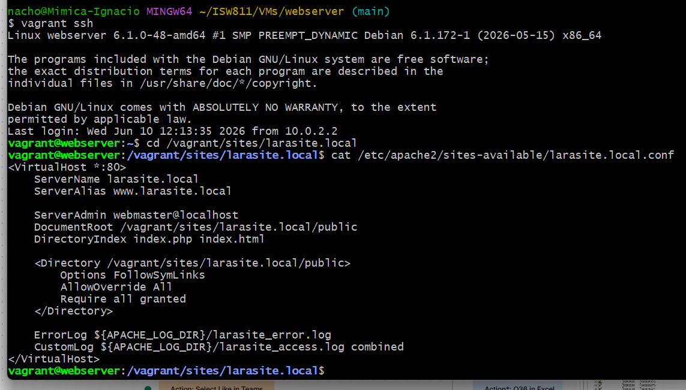

---

## 4. Verificación del entorno LAMP

Una vez dentro de la máquina virtual, se verificó el funcionamiento de los principales componentes del entorno LAMP: PHP, Apache y MariaDB.

Los comandos ejecutados fueron:

```bash
php -v
sudo apache2ctl -v
mysql --version
sudo systemctl status apache2 --no-pager
```

Con estos comandos se confirmó que PHP estaba instalado, que Apache se encontraba disponible como servidor web, que MariaDB estaba instalado como sistema gestor de base de datos y que el servicio de Apache se encontraba activo.

Esta verificación fue importante porque Laravel requiere PHP para ejecutarse, Apache para servir la aplicación web y MariaDB para almacenar los datos del proyecto.

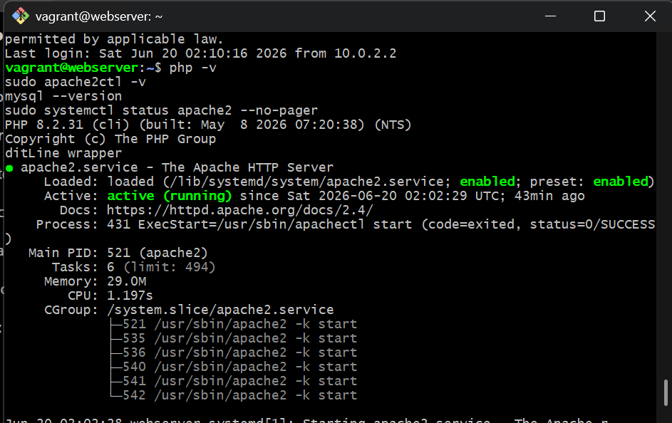

---

## 5. Instalación y verificación de Composer

Composer se utilizó como gestor de dependencias para PHP. Esta herramienta es necesaria para instalar Laravel y administrar las librerías que el proyecto requiere.

Para verificar la instalación de Composer se ejecutó:

```bash
composer --version
```

El resultado mostró la versión instalada de Composer, confirmando que la herramienta quedó disponible globalmente dentro de la máquina virtual.

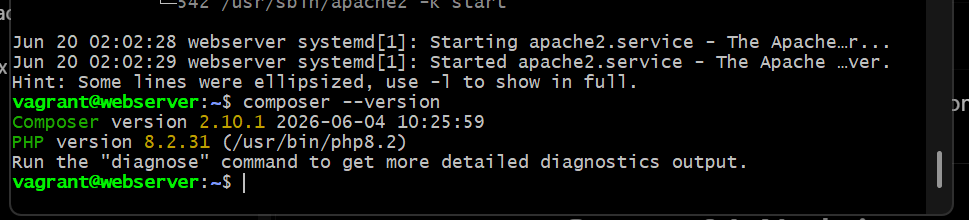

---

## 6. Instalación y verificación de Node.js y npm

Laravel puede requerir herramientas del ecosistema JavaScript, especialmente para trabajar con Vite, recursos frontend y dependencias administradas mediante npm.

Node.js y npm fueron instalados mediante `nvm`. Para verificar que ambos quedaron correctamente disponibles, se ejecutaron los siguientes comandos:

```bash
node -v
npm -v
```

El resultado mostró las versiones instaladas de Node.js y npm.

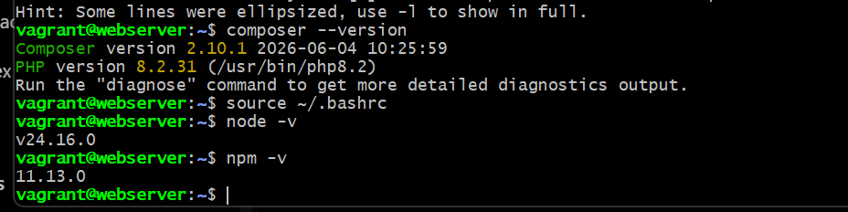

---

## 7. Instalación de Laravel Installer

Para facilitar la creación del proyecto Laravel, se instaló Laravel Installer mediante Composer.

La instalación se realizó con Composer y posteriormente se verificó con:

```bash
laravel --version
```

El resultado confirmó que Laravel Installer quedó disponible en la terminal de Debian y que era posible utilizarlo para crear proyectos Laravel.

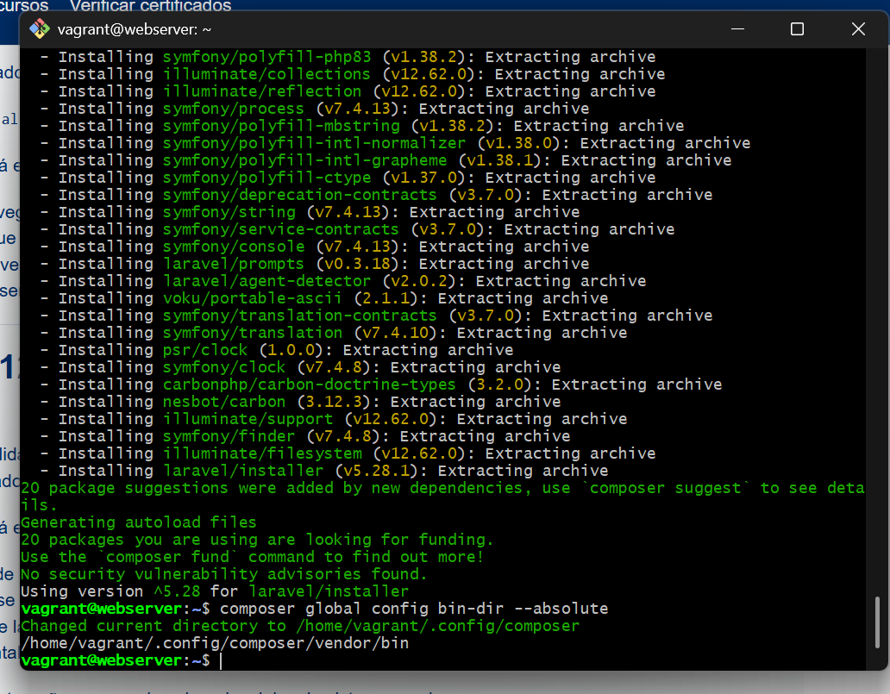

---

## 8. Creación del proyecto Laravel `larasite.local`

El proyecto Laravel fue creado dentro de la carpeta compartida entre Windows y Debian. En Debian, el proyecto se trabajó desde la ruta:

```text
/home/vagrant/sites/larasite.local
```

También se puede acceder mediante la ruta:

```text
/vagrant/sites/larasite.local
```

El proyecto se creó con el nombre:

```text
larasite.local
```

Después de la creación del proyecto, se verificó su estructura y la versión de Laravel con los comandos:

```bash
cd /vagrant/sites/larasite.local
ls -la
php artisan --version
```

Durante esta parte se presentó un problema inicial: el proyecto fue creado, pero las dependencias de Composer no quedaron instaladas completamente. Al ejecutar `php artisan --version`, Laravel mostró un error indicando que no existía el archivo:

```text
vendor/autoload.php
```

Esto indicaba que faltaba completar la instalación de dependencias. Para corregirlo, se ejecutó el siguiente comando dentro de la carpeta del proyecto:

```bash
composer install
```

Después de completar correctamente la instalación de dependencias, el comando `php artisan --version` funcionó correctamente.

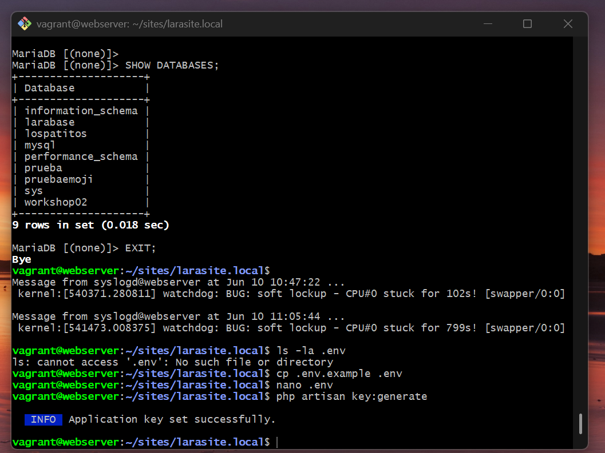

---

## 9. Creación de la base de datos y usuario en MariaDB

Para conectar el proyecto Laravel con MariaDB, se creó una base de datos llamada:

```text
larabase
```

También se creó un usuario llamado:

```text
larauser
```

con la contraseña de laboratorio:

```text
secret
```

Los comandos SQL utilizados fueron:

```sql
CREATE DATABASE larabase;

CREATE USER 'larauser'@'localhost'
IDENTIFIED BY 'secret';

GRANT ALL PRIVILEGES
ON larabase.*
TO 'larauser'@'localhost';

FLUSH PRIVILEGES;
```

Esta configuración permitió que Laravel se conectara a MariaDB utilizando un usuario específico para el proyecto, en lugar de utilizar el usuario administrador `root`.

---

## 10. Configuración del archivo `.env`

Laravel utiliza el archivo `.env` para definir variables de entorno, incluyendo la configuración de conexión a la base de datos.

En este taller se configuró el archivo `.env` para que Laravel utilizara MariaDB y la base de datos `larabase`.

La configuración aplicada fue:

```env
DB_CONNECTION=mariadb
DB_HOST=127.0.0.1
DB_PORT=3306
DB_DATABASE=larabase
DB_USERNAME=larauser
DB_PASSWORD=secret
```

Para verificar la configuración se ejecutó:

```bash
cd /vagrant/sites/larasite.local
grep -n "^DB_" .env
```

Inicialmente, Laravel intentó utilizar SQLite porque el archivo `.env` todavía tenía configurado:

```env
DB_CONNECTION=sqlite
```

Esto provocó que Laravel preguntara si se deseaba crear el archivo `database.sqlite`. Como el objetivo del taller era utilizar MariaDB, se canceló ese proceso y se corrigió el archivo `.env`.

Después de editar la configuración, se limpió la configuración cacheada de Laravel con:

```bash
php artisan config:clear
rm -f bootstrap/cache/config.php
```

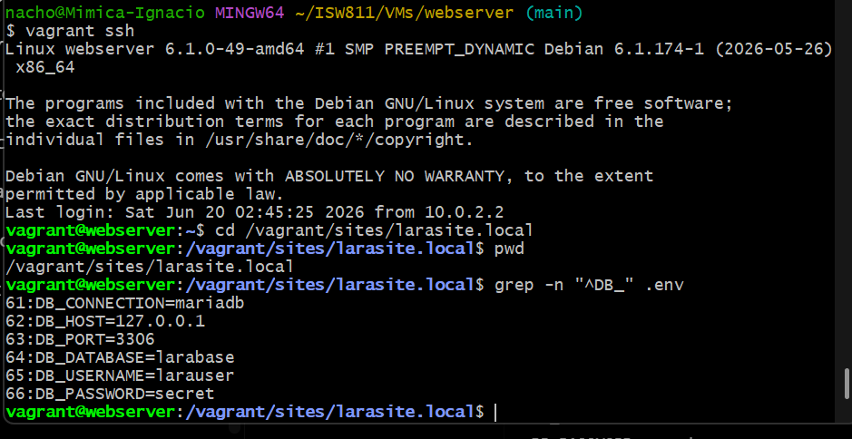

---

## 11. Ejecución de migraciones de Laravel

Después de configurar correctamente la conexión a MariaDB, se ejecutaron las migraciones de Laravel.

El comando utilizado fue:

```bash
php artisan migrate
```

Las migraciones permitieron crear automáticamente las tablas iniciales del proyecto Laravel dentro de la base de datos `larabase`.

Durante esta etapa también se presentó un error al intentar ejecutar antes el comando:

```bash
php artisan cache:clear
```

El error indicaba que la tabla `cache` todavía no existía. Esto ocurrió porque las migraciones aún no se habían ejecutado. La solución fue ejecutar primero:

```bash
php artisan migrate
```

Después de ejecutar las migraciones, Laravel creó las tablas necesarias en la base de datos.

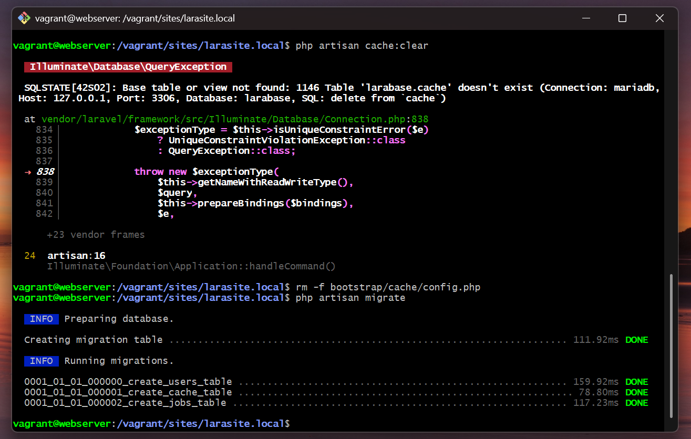

---

## 12. Configuración del virtual host de Apache

Para servir el proyecto Laravel desde Apache, se creó el archivo de configuración:

```text
/etc/apache2/sites-available/larasite.local.conf
```

El archivo contiene la configuración del virtual host para el dominio local `larasite.local`.

El contenido utilizado fue:

```apache
<VirtualHost *:80>
    ServerName larasite.local
    ServerAlias www.larasite.local

    ServerAdmin webmaster@localhost
    DocumentRoot /vagrant/sites/larasite.local/public
    DirectoryIndex index.php index.html

    <Directory /vagrant/sites/larasite.local/public>
        Options FollowSymLinks
        AllowOverride All
        Require all granted
    </Directory>

    ErrorLog ${APACHE_LOG_DIR}/larasite_error.log
    CustomLog ${APACHE_LOG_DIR}/larasite_access.log combined
</VirtualHost>
```

La directiva más importante en esta configuración es:

```apache
DocumentRoot /vagrant/sites/larasite.local/public
```

Laravel debe servirse desde la carpeta `public`, ya que esta contiene el archivo `index.php`, que funciona como punto de entrada de la aplicación. Por seguridad, Apache no debe apuntar directamente a la raíz del proyecto, sino únicamente a la carpeta `public`.

El sitio fue habilitado con:

```bash
sudo a2ensite larasite.local.conf
```

También se habilitó el módulo `rewrite`, necesario para que Laravel pueda manejar correctamente sus rutas:

```bash
sudo a2enmod rewrite
```

Después se validó la configuración de Apache:

```bash
sudo apache2ctl configtest
```

El resultado esperado fue:

```text
Syntax OK
```

Finalmente, se reinició Apache y se verificó su estado:

```bash
sudo systemctl restart apache2
sudo systemctl status apache2 --no-pager
```

Una copia del archivo `larasite.local.conf` fue incluida en el entregable dentro de:

```text
apache-conf/larasite.local.conf
```

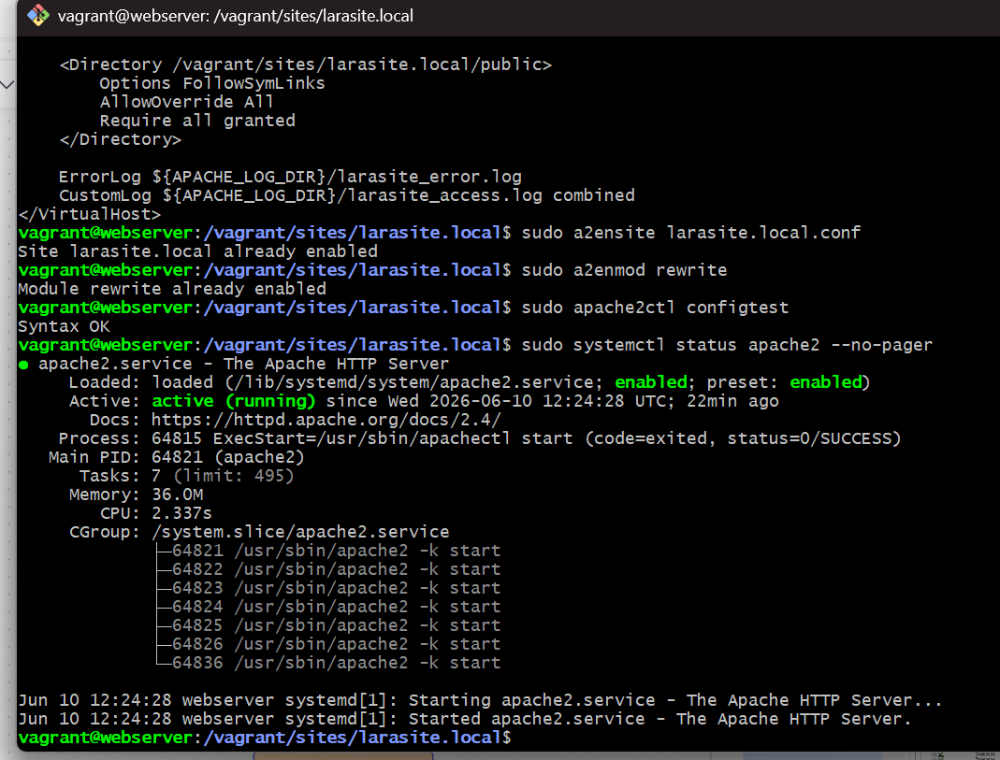

---

## 13. Configuración del archivo hosts en Windows

Para acceder al dominio `larasite.local` desde el navegador de Windows, fue necesario editar el archivo `hosts` de la máquina anfitriona.

En Windows, este archivo se encuentra normalmente en:

```text
C:\Windows\System32\drivers\etc\hosts
```

La línea agregada fue:

```text
192.168.56.10 larasite.local www.larasite.local
```

El archivo `hosts` permite asociar manualmente un nombre de dominio con una dirección IP. En este caso, se utilizó para que Windows resolviera `larasite.local` hacia la dirección IP privada de la máquina virtual Debian.

Al inicio, el comando:

```bash
ping larasite.local
```

no resolvía el dominio. El problema se corrigió editando correctamente el archivo `hosts` como administrador y limpiando la caché DNS de Windows con:

```bash
ipconfig /flushdns
```

Después de este ajuste, el dominio resolvió correctamente hacia:

```text
192.168.56.10
```

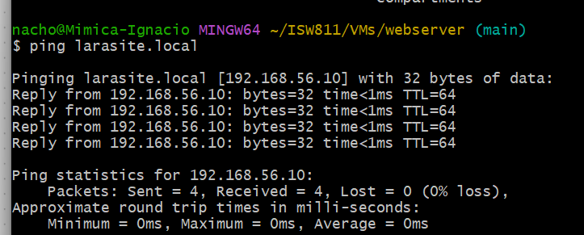

---

## 14. Verificación de Laravel desde el navegador

Después de configurar Apache y el archivo `hosts`, se abrió el navegador web de la máquina anfitriona y se ingresó a:

```text
http://larasite.local
```

El resultado fue exitoso, ya que se mostró la página inicial de Laravel utilizando el dominio local configurado.

Esto confirma que el proyecto Laravel se está ejecutando mediante Apache y no únicamente mediante el servidor de desarrollo `php artisan serve`.

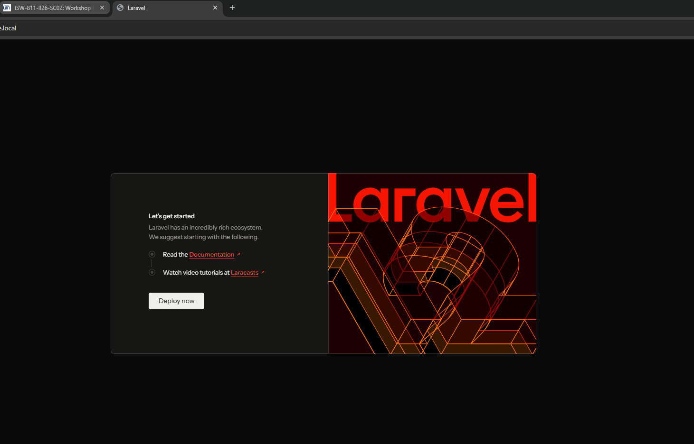

---

## 15. Evidencia adicional de base de datos con DBeaver

Como evidencia adicional, se utilizó DBeaver desde Windows para conectarse a la base de datos MariaDB dentro de la máquina virtual.

Para permitir la conexión desde Windows, se modificó la configuración de MariaDB. Primero se verificó el valor de `bind-address`:

```bash
sudo grep -n "bind-address" /etc/mysql/mariadb.conf.d/50-server.cnf
```

El valor inicial era:

```text
bind-address = 127.0.0.1
```

Este valor solo permitía conexiones locales dentro de Debian. Para permitir la conexión desde la máquina anfitriona, se cambió a:

```text
bind-address = 0.0.0.0
```

El comando utilizado fue:

```bash
sudo sed -i 's/^[[:space:]]*bind-address[[:space:]]*=.*/bind-address = 0.0.0.0/' /etc/mysql/mariadb.conf.d/50-server.cnf
```

Luego se reinició MariaDB:

```bash
sudo systemctl restart mariadb
```

También se otorgaron permisos al usuario `larauser` para conectarse desde la red privada de VirtualBox:

```bash
sudo mysql -e "CREATE USER IF NOT EXISTS 'larauser'@'192.168.56.%' IDENTIFIED BY 'secret'; GRANT ALL PRIVILEGES ON larabase.* TO 'larauser'@'192.168.56.%'; FLUSH PRIVILEGES;"
```

La conexión en DBeaver se configuró con los siguientes datos:

```text
Tipo de conexión: MariaDB/MySQL
Host: 192.168.56.10
Puerto: 3306
Base de datos: larabase
Usuario: larauser
Contraseña: secret
```

Después de realizar la conexión, se verificó que la base de datos `larabase` contenía las tablas generadas por Laravel.

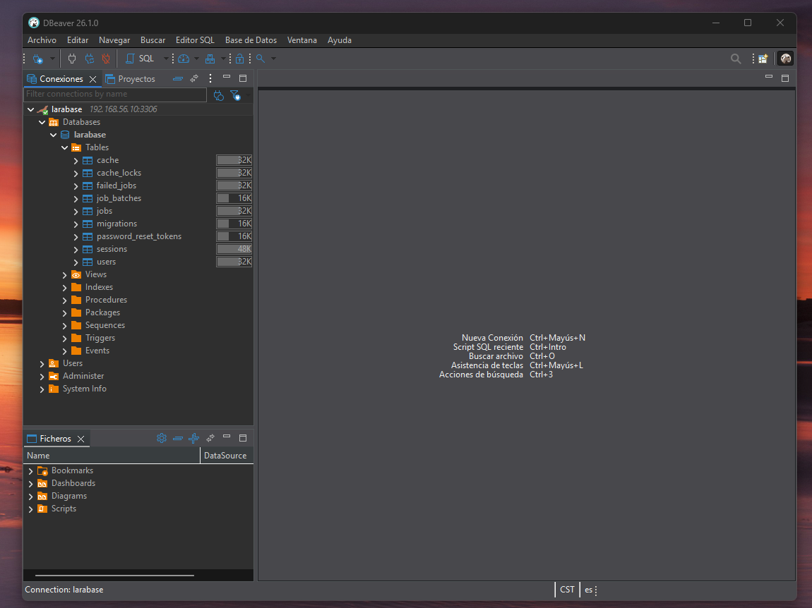

---

## 16. Evidencia de tablas creadas en MariaDB

Además de la evidencia gráfica en DBeaver, se generó un archivo de evidencia en Markdown con el resultado del comando:

```bash
sudo mysql -e "USE larabase; SHOW TABLES;"
```

Este archivo se encuentra en:

```text
database/evidencia-larabase.md
```

El objetivo de esta evidencia es demostrar que las tablas fueron creadas correctamente dentro de la base de datos `larabase` después de ejecutar las migraciones de Laravel.

---

## 17. Problemas encontrados y soluciones aplicadas

Durante el desarrollo del taller se presentaron algunos problemas que fueron corregidos durante la práctica.

### 17.1 Problema de resolución DNS en Debian

Al intentar descargar Composer, Debian inicialmente no podía resolver nombres de dominio. El mensaje indicaba un problema de resolución DNS.

Se verificó que la máquina virtual sí tenía conexión a internet mediante IP, pero no podía resolver dominios. La solución aplicada fue editar el archivo:

```text
/etc/resolv.conf
```

y configurar servidores DNS públicos:

```text
nameserver 8.8.8.8
nameserver 1.1.1.1
```

Después de este ajuste, Debian pudo resolver dominios correctamente y se continuó con la instalación de Composer.

### 17.2 Instalación incompleta de dependencias de Composer

Después de crear el proyecto Laravel, el comando:

```bash
php artisan --version
```

falló porque no existía el archivo:

```text
vendor/autoload.php
```

Esto indicaba que las dependencias no se habían instalado completamente. La solución fue entrar a la carpeta del proyecto y ejecutar:

```bash
composer install
```

Durante un primer intento, Composer tardó demasiado en descomprimir algunos paquetes. Posteriormente se repitió el proceso con la computadora fuera del modo de ahorro de batería y la instalación finalizó correctamente.

### 17.3 Laravel intentaba usar SQLite

Al ejecutar inicialmente:

```bash
php artisan migrate
```

Laravel mostró una advertencia relacionada con SQLite. Esto ocurrió porque el archivo `.env` todavía tenía configurada la conexión SQLite.

La solución fue corregir las variables de base de datos en `.env` para usar MariaDB:

```env
DB_CONNECTION=mariadb
DB_HOST=127.0.0.1
DB_PORT=3306
DB_DATABASE=larabase
DB_USERNAME=larauser
DB_PASSWORD=secret
```

Después se limpió la configuración cacheada de Laravel con:

```bash
php artisan config:clear
rm -f bootstrap/cache/config.php
```

### 17.4 Tabla `cache` inexistente antes de migrar

Al ejecutar:

```bash
php artisan cache:clear
```

antes de las migraciones, Laravel intentó limpiar la tabla `cache`, pero esta todavía no existía en la base de datos.

La solución fue ejecutar primero:

```bash
php artisan migrate
```

Con esto se crearon las tablas necesarias, incluyendo la tabla `cache`.

### 17.5 Dominio local no resolvía en Windows

Después de configurar Apache, el navegador no cargaba `larasite.local` porque Windows todavía no resolvía el dominio. El comando:

```bash
ping larasite.local
```

indicaba que no se encontraba el host.

La solución fue editar el archivo `hosts` como administrador y agregar la línea:

```text
192.168.56.10 larasite.local www.larasite.local
```

Luego se limpió la caché DNS con:

```bash
ipconfig /flushdns
```

Después de esto, el dominio resolvió correctamente y la página de Laravel cargó en el navegador.

---

## 18. Reconstrucción del proyecto

El entregable no incluye la carpeta `vendor/` ni la carpeta `node_modules/`, ya que son carpetas grandes que pueden reconstruirse a partir de los archivos del proyecto.

Para reconstruir las dependencias PHP del proyecto Laravel, se puede ejecutar:

```bash
cd larasite.local
composer install
```

Para instalar dependencias de Node.js, se puede ejecutar:

```bash
npm install
```

En este proyecto no se incluye `package-lock.json`, ya que no fue necesario ejecutar `npm install` durante la creación del proyecto. Sin embargo, sí se conserva el archivo `package.json`.

---

## 19. Repositorio Git

El trabajo se mantiene dentro del repositorio Git de los talleres del curso. El objetivo de incluirlo en GitHub es conservar el historial del trabajo realizado y permitir la revisión del entregable.

Para registrar los cambios del Workshop 03 se pueden utilizar los siguientes comandos:

```bash
git status
git add Workshop03
git commit -m "Agregar Workshop03 Laravel"
git push
```

---

## 20. Conclusión

El Workshop 03 permitió configurar un entorno completo para desarrollo Laravel utilizando Debian 12, Vagrant, VirtualBox, Apache, MariaDB, Composer, Node.js y npm.

Como resultado final, se logró crear y ejecutar correctamente el proyecto:

```text
larasite.local
```

También se configuró la base de datos:

```text
larabase
```

se ejecutaron las migraciones de Laravel, se configuró Apache mediante un virtual host y se accedió correctamente al sitio desde la máquina anfitriona utilizando el dominio local:

```text
http://larasite.local
```

El resultado final demuestra que Laravel fue servido correctamente desde Apache utilizando la carpeta `public` como punto de entrada, cumpliendo con los requisitos técnicos solicitados para el taller.
